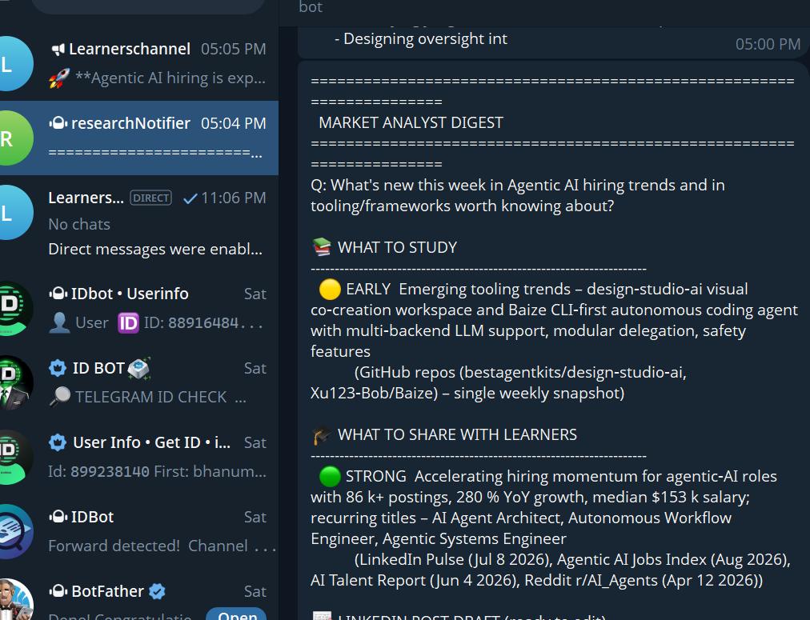
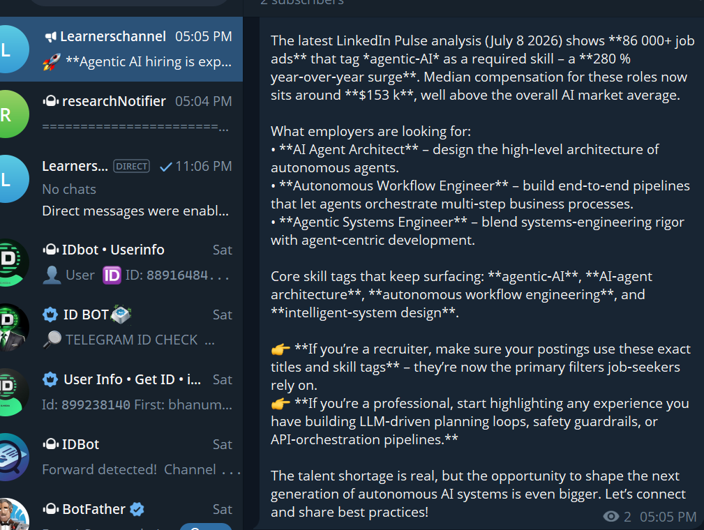
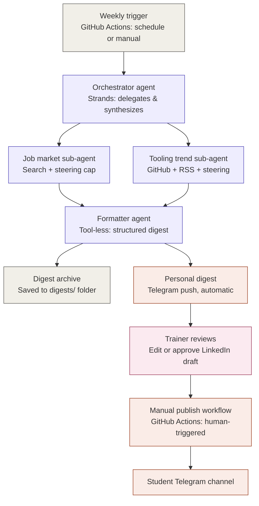

# Research Assistant - Agentic Market & Content Analyst

**Weekly Agentic AI trend research, drafted into ready-to-use content, with
a human always in control of what gets published.**

Built on the [Strands Agents SDK](https://strandsagents.com) for a real
solopreneur problem: staying current in a fast-moving field while also
producing the training content that field demands — without spending every
week re-doing the same manual research from scratch.

<!--
  PLACEHOLDER: clickable video thumbnail. Replace YOUTUBE_ID and
  THUMBNAIL_URL once the video is uploaded and public. Standard trick:
  a linked image that looks like a play button, since GitHub won't embed
  a real YouTube player in a README.
-->
[![Watch the 3-minute demo]
https://youtu.be/8uAp2hFxO6g

---

## The problem

Anyone teaching or working in a fast-moving field faces the same weekly
loop: check job boards, skim GitHub trending, read a stack of newsletters,
try to tell real signal from noise — every week, from scratch, with no
memory of what was already checked last time.

**Who this is for**: independent AI trainers, educators, and consultants
who need two different things from the same research — material to keep
their own skills current, and concrete content to teach with — but don't
have a research team to produce either.

**Why it matters**: most research tools hand you information. This hands
you a drafted LinkedIn post and outlined training modules — the gap between
"here's what's happening" and "here's something you can publish or teach
this week" is exactly what it closes.

## See it run

<!--
  PLACEHOLDER: record a short (10-20s) terminal session showing a real run
  — the tool-call trace, the classified findings, the LinkedIn draft
  appearing — and convert it to a GIF (e.g. with `asciinema` + `agg`, or
  a screen recording converted via ffmpeg/gifski). Drop the file at
  docs/demo.gif in the repo and this will render inline and autoplay.
-->

<!--
  PLACEHOLDER: a phone screenshot of the Telegram digest arriving, and/or
  the GitHub Actions run summary showing both workflows. Static images —
  drag into the GitHub web editor or reference a file in docs/.
-->



| Personal digest, delivered automatically | Publishing is a separate, manual step |
|---|---|


## How it works



**Legend**: purple = Strands agent step · coral = external automation/service
(Telegram, GitHub Actions) · pink = human step · gray = trigger/storage.

## What it actually does

- **Researches** hiring trends and tooling trends in parallel, via two
  specialized Strands sub-agents delegated to by an orchestrator.
- **Remembers** what it already reported — a dedupe memory layer means a
  weekly run surfaces only what's new, not the same items re-summarized.
- **Classifies** every finding by signal strength — "strong" if corroborated
  across multiple sources, "early" if from just one — so it's clear what to
  teach confidently versus what to just watch.
- **Drafts content directly**: a ready-to-edit LinkedIn post from the
  strongest finding, and 1–3 training-module ideas with learning objectives
  and key points.
- **Keeps a human in control of publishing**: the digest reaches the
  trainer automatically and privately every week. Nothing reaches a
  student-facing channel without a separate, manually-triggered action.

## Strands features used — and why each one is there

Every one of these exists because a real bug or design need surfaced it
during development, not as a checklist:

| Feature | Why it's here |
|---|---|
| **Multi-agent orchestration** (Agent-as-Tool) | Delegation to specialized sub-agents, each with a narrow scope, instead of one agent doing everything |
| **Steering** (`vended_plugins.steering`) | A real per-tool call budget with feedback the model can act on — replaced a hard-cutoff workaround after a sub-agent got stuck looping on a tool that couldn't do what it was trying to do |
| **Structured output** (Pydantic) | The digest is a typed schema, not prose the model is asked to format |
| **A separate tool-less formatter agent** | `structured_output()` internally disallows further tool calls — an agent that still has tools attached can try to use them anyway, which some model backends reject outright. A dedicated tool-less agent makes that failure structurally impossible |
| **`ModelRetryStrategy`** | Real throttling protection, restored after being accidentally misconfigured while chasing an unrelated (tool-execution, not throttling) bug |
| **Native observability** (`StrandsTelemetry`) | OpenTelemetry traces of every model and tool call, used throughout development to actually see the tool-call loop and delegation decisions |

## Tech stack

- **Strands Agents SDK** (Python) — orchestration, sub-agents, steering, structured output, telemetry
- **Groq** (via Strands' OpenAI-compatible interface) — model provider for this submission; AWS Bedrock also supported via one env var
- **GitHub Actions** — free scheduled + manual triggers, no server to run or maintain
- **Telegram Bot API** — push-only notifications, no webhook or persistent process needed
- **DuckDuckGo search, GitHub Search API, RSS feeds** — the underlying research tools

## Setup

```bash
cp .env.example .env   # fill in GROQ_API_KEY at minimum
pip install -r requirements_hackathon.txt
python hackathon_agent.py
```

For the scheduled + Telegram + approval-gated publish flow, see
`.env.example` and the two workflows under `.github/workflows/`.

## License

MIT — see [LICENSE](./LICENSE).
